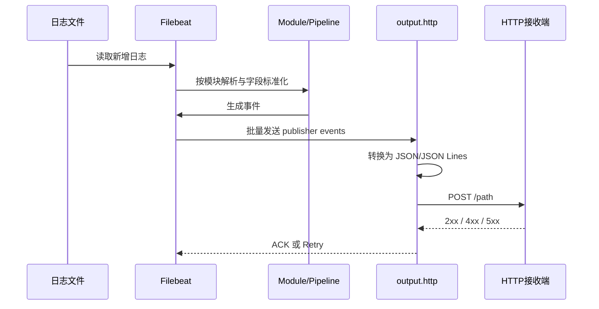
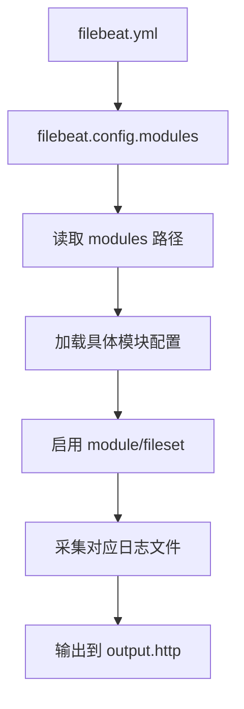
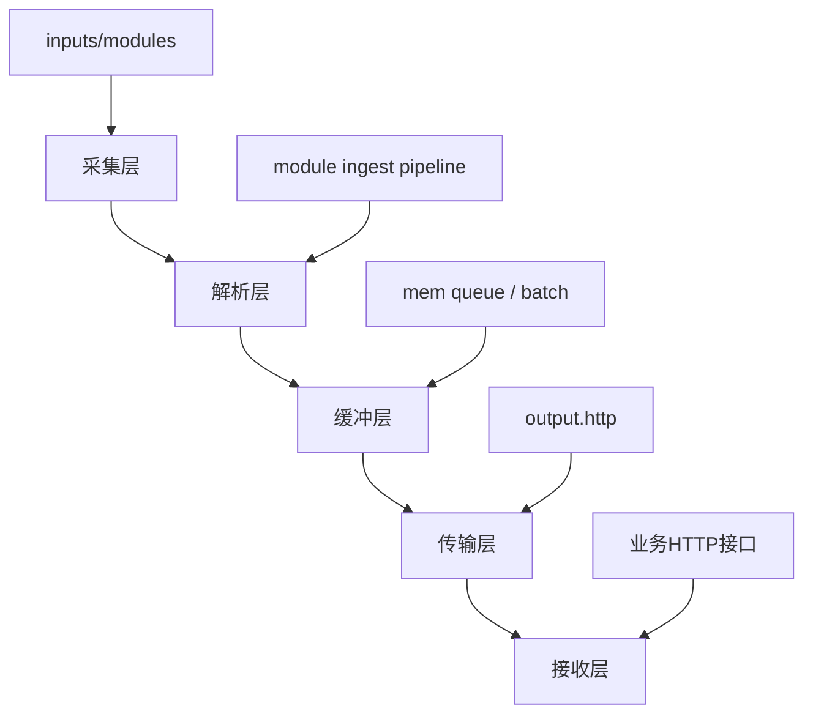

# 项目技术文档

## 1. 项目概述

本项目是一个基于 `Elastic Beats / Filebeat` 二次开发的日志采集与转发系统，核心目标不是把日志发送到 Elasticsearch，而是把 Filebeat 采集、解析、标准化后的事件通过自定义 `HTTP Output` 发送到指定的 HTTP 服务。

可以把它理解成：

`Filebeat 采集能力` + `现成模块解析能力` + `自定义 HTTP 输出能力` + `可选的外层进程包装`

它适合的场景包括：

- 将服务器日志统一上报到公司内部日志平台
- 将 Filebeat 采集到的结构化事件投递给自研接收接口
- 用 HTTP API 替代 Elasticsearch / Logstash 作为下游入口
- 在边缘节点、业务主机上做轻量日志采集转发

## 2. 项目当前在做什么

从仓库内容看，这个项目主要做了三件事：

1. 保留并复用了 Filebeat 原生的日志采集、模块解析、状态管理能力
2. 在 `libbeat/outputs/http` 中注册了一个新的 `output.http` 输出插件
3. 提供了一个额外的外层 Go 程序，尝试做配置生成、拉起 `filebeatexc`、异常退出拉起等包装动作

换句话说，真正的数据处理主链路还是 Filebeat；这个仓库的核心定制点是 “把输出端改成 HTTP”。

## 3. 总体架构


## 4. 核心流程说明

### 4.1 运行主链路



### 4.2 配置加载流程



## 5. 代码结构解读

### 5.1 关键目录

- `filebeat/main.go`
  真正的 Filebeat 入口，调用官方 `cmd.Filebeat(...)` 启动采集流程。
- `libbeat/outputs/http`
  本项目最核心的定制模块，实现了 `output.http` 插件。
- `modules.d`
  运行时模块配置样例，决定采集哪些类型的日志。
- `module`
  Filebeat 各模块的解析规则、字段定义、测试样例、ingest pipeline 等。
- `config/config.go`
  用于根据 JSON 输入动态生成模块配置内容。
- `infra/log.go`
  项目自己的本地日志封装，基于 `lumberjack` 做滚动日志。
- `main.go`
  额外的包装启动器，意图负责启动 `filebeatexc` 并做异常重启。
- `test.go`
  压测/验证辅助程序，会生成测试日志并监控进程资源。

### 5.2 关键文件职责

#### `filebeat/main.go`

这个文件基本就是标准 Filebeat 启动入口：

- 初始化默认 inputs
- 注册自定义 `output.http`
- 执行 Filebeat 命令

因此，项目真正可持续复用的主能力，仍然是这条标准 Beats 运行链路。

#### `libbeat/outputs/http/http.go`

这里通过：

- `outputs.RegisterType("http", MakeHTTP)`

把 `http` 注册为一个新的输出类型。也就是说，只要配置里写：

```yaml
output:
  http:
```

Filebeat 就会进入这里创建输出客户端。

#### `libbeat/outputs/http/config.go`

这里定义了 HTTP 输出插件支持的配置项，包括：

- `hosts`
- `path`
- `proxy_url`
- `loadbalance`
- `batch_publish`
- `batch_size`
- `compression_level`
- `tls`
- `max_retries`
- `timeout`
- `headers`
- `content_type`
- `backoff`
- `format`

默认行为比较关键：

- `batch_publish: true`
- `batch_size: 2048`
- `max_retries: 3`
- `timeout: 90s`
- `format: json`

#### `libbeat/outputs/http/client.go`

这里实现了 HTTP 请求真正发送逻辑，核心点包括：

- 支持单条发送和批量发送
- 支持 Basic Auth
- 支持代理
- 支持超时控制
- 支持失败重试
- 支持 gzip 压缩
- 按 `json` 或 `json_lines` 格式编码请求体

状态码处理逻辑值得特别注意：

- `400` 和 `500` 被视为不重试
- `>= 300` 的其他状态会触发重试

这意味着：

- 对于服务端内部错误 `500`，当前实现直接丢弃，不会重试
- 这对生产环境来说通常风险较高

#### `config/config.go`

这个文件负责根据外部 JSON 描述生成模块片段配置，支持两种思路：

- `mode = 0`
  直接读取现成模块配置文件内容
- `mode = 1`
  根据日志路径动态拼接模块配置

目前它主要能生成：

- `access`
- `error`
- `syslog`
- `mysql.slowlog`

这个能力说明项目设计里原本是考虑过“由上层平台动态下发采集任务”的。

## 6. 当前配置状态分析

### 6.1 主配置文件

当前根目录 [filebeat.yml](/d:/电信工作/filebeat_http_output/filebeat.yml:1) 配置的是：

```yaml
filebeat:
  config:
    modules:
      enabled: true
      path: ./modules.d/filebeat.yml
```

这意味着当前运行时不是扫描整个 `modules.d/*.yml`，而是只加载单个文件：

- `modules.d/filebeat.yml`

因此，虽然 `modules.d` 目录下还有：

- `mysql.yml`
- `mongodb.yml`
- `kafka.yml`
- `apache.yml`

但按当前主配置，它们默认并不会被加载。

### 6.2 当前实际启用模块

从 [modules.d/filebeat.yml](/d:/电信工作/filebeat_http_output/modules.d/filebeat.yml:1) 看，当前实际启用的是：

- `system` 模块
- `syslog` fileset
- 采集路径为 `/var/log/test/test.log*`

所以从当前配置状态判断：

- 项目现在更像是在演示或测试 `system/syslog` 采集
- 你在 IDE 中打开的 `mysql.yml`、`mongodb.yml`、`kafka.yml`、`apache.yml` 更像是备用样例，而不是当前默认生效配置

### 6.3 HTTP 输出配置

当前 [filebeat.yml](/d:/电信工作/filebeat_http_output/filebeat.yml:1) 中 HTTP 输出仍是示例值：

- `hosts: ["http://example.com:8080"]`
- `path: "/receive/log"`

这说明仓库里的根配置还没有完成生产化落地，需要替换为真实接收端地址。

## 7. 已支持的采集设计

从仓库包含的模块和配置来看，当前项目至少围绕以下日志类型做了准备：

- `system`
- `apache`
- `mysql`
- `mongodb`
- `kafka`
- 以及 Filebeat 自带的其他标准模块能力

其中你当前打开的几个模块示例如下：

- `apache.yml`
  采集 Apache `access` 和 `error`
- `mysql.yml`
  采集 MySQL `error` 和 `slowlog`
- `mongodb.yml`
  当前样例里 `log.enabled: false`
- `kafka.yml`
  当前样例里 `log.enabled: true`

## 8. 设计拆解

### 8.1 逻辑分层设计



分层职责如下：

- 采集层
  负责监控文件、读取新增日志、跟踪 offset
- 解析层
  负责按模块识别日志格式并转为结构化事件
- 缓冲层
  负责批量、内存队列、flush 控制
- 传输层
  负责 HTTP 编码、压缩、认证、重试
- 接收层
  负责接入平台接收、落库、检索、告警等后续处理

### 8.2 输出设计

当前 HTTP 输出设计支持以下模式：

- 批量发送模式
  将一个 batch 中的多个事件一次 POST 到服务端
- 单条发送模式
  遍历逐条 POST

编码格式支持：

- `json`
  整个批次作为 JSON 数组或单个 JSON 对象
- `json_lines`
  每条事件一行，适合流式接收端

压缩设计支持：

- `compression_level = 0`
  不压缩
- `compression_level = 1~9`
  gzip 压缩发送

### 8.3 事件结构设计

发送前事件会被整理为：

- `@timestamp`
- Filebeat 采集出的原始字段集合

`client.go` 中的 `makeEvent` 会把 `Fields` 平铺到顶层 JSON，这样下游接收端拿到的数据更直接，但也意味着：

- 字段名冲突要由上游模块或下游接收方自己控制

## 9. 关键运行方式

### 9.1 推荐理解方式

这个仓库实际上存在两种运行思路：

#### 方式 A：直接运行 `filebeat` 入口

即使用 [filebeat/main.go](/d:/电信工作/filebeat_http_output/filebeat/main.go:1) 编译运行。

特点：

- 结构更标准
- 更接近正常 Filebeat 发行版
- 适合生产主线

#### 方式 B：运行根目录 `main.go` 包装器

它尝试：

- 生成配置
- 检查 `filebeatexc`
- 拉起子进程
- 异常退出自动重启

但从当前仓库状态看，这个包装器代码并不完整，至少存在：

- 引用了 `send_bussiness` 包，但仓库里未找到对应目录
- 代码里使用了 `configFile`，但当前文件中未看到其定义

因此当前更像是“半成品的外层控制器”，而不是稳定主入口。

## 10. 当前仓库的主要风险点

### 10.1 配置加载路径容易误解

当前主配置只加载 `./modules.d/filebeat.yml`，不是整个目录。这个设置很容易让维护者误以为多个模块样例都生效了。

### 10.2 外层包装器可能无法直接编译

根目录 `main.go` 存在未在仓库中明确闭合的依赖关系，说明它未必处于可直接构建状态。

### 10.3 500 状态码不重试

在 `output.http` 中，`500` 被当作不重试处理，这会导致下游服务临时故障时数据直接丢失。

### 10.4 本地日志模块注释乱码

`config/config.go` 和 `infra/log.go` 中存在明显编码乱码注释，说明文件编码历史可能不统一，后续维护时需要留意。

### 10.5 根 README 与实际实现之间有少量偏差

例如 README 说“wrapper in this repository”可以使用，但从代码状态看，这层包装未完全落稳，文档和实现之间存在轻微不一致。

## 11. 推荐优化方向

### 11.1 配置层

- 将 `filebeat.config.modules.path` 改为 `./modules.d/*.yml`
- 区分 `example` 配置与 `production` 配置
- 给每个模块配置补充注释，明确默认是否启用

### 11.2 可靠性层

- 将 `500` 改为可重试
- 明确区分可重试错误和不可重试错误
- 增加下游接口失败指标与告警

### 11.3 工程层

- 明确主入口，只保留一个生产级启动方案
- 若保留包装器，补齐缺失依赖和配置来源
- 增加集成测试，覆盖 HTTP 输出成功、超时、4xx、5xx、压缩、批量模式

### 11.4 可观测性层

- 给 HTTP 输出增加成功数、失败数、重试数、耗时指标
- 对每个 batch 增加 trace id 或 request id
- 明确接收端返回体的日志记录策略

## 12. 建议的生产部署架构


建议说明：

- Agent 只负责采集和可靠投递
- 接入层负责认证、限流、灰度、负载均衡
- 接收服务负责协议适配和快速落盘
- 后端异步处理负责解析增强、索引、告警

## 13. 适合对外介绍的项目说明

如果需要一句话介绍这个项目，可以这样描述：

> 这是一个基于 Filebeat 深度定制的日志采集代理，复用了 Beats 的成熟采集与模块解析能力，并通过自定义 HTTP Output 将结构化日志直接投递到企业内部日志接收平台。

如果需要一段较完整描述，可以这样写：

> 本项目在 Elastic Filebeat 基础上扩展了自定义 HTTP 输出插件，使日志采集端能够继续复用 Filebeat 对系统日志、Web 日志、中间件日志的模块化采集与解析能力，同时摆脱对 Elasticsearch 作为唯一输出端的依赖。采集到的日志会经过 Filebeat 标准 pipeline 标准化后，以 JSON 或 JSON Lines 形式通过 HTTP POST 发送到内部接收服务，适用于企业内部统一日志平台建设、边缘节点日志汇聚与自研观测平台接入等场景。

## 14. 文档结论

这个项目的本质不是一个全新日志系统，而是一个“定制版 Filebeat 分发包”：

- 上游采集能力继承自 Filebeat
- 中间解析能力继承自 Filebeat Modules
- 核心创新点在于自定义 `HTTP Output`
- 当前仓库配置偏演示性质，包装层代码尚未完全收敛

如果后续你要把它作为正式交付项目推进，建议优先做三件事：

1. 明确唯一生产入口
2. 收敛配置加载方式
3. 修正 HTTP 失败重试策略

